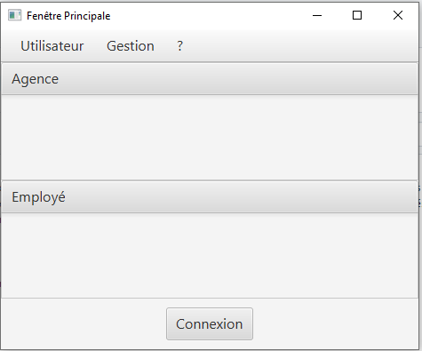
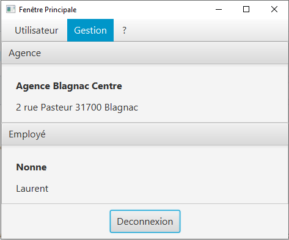
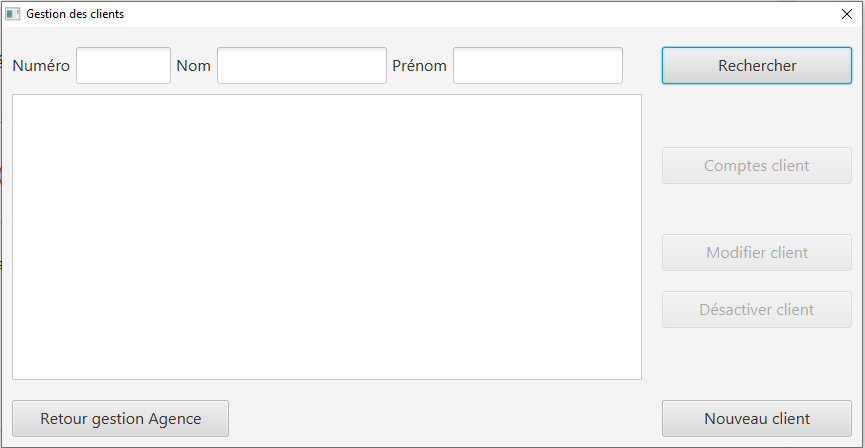
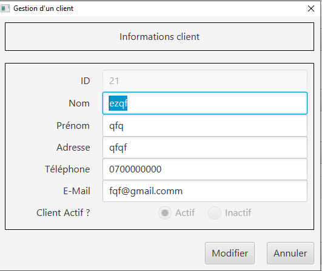

= Documentation Utilisateurs V0
:toc:
:toc-title: Sommaire

== Équipe
* Bastien BALMES 
* Léo FALETTI
* Esteban BIRET-TOSCANO
* Hugo VACQUIER

== 1. Présentation de l’application

"La banque DailyBank souhaite développer une application JAVA-Oracle de gestion des comptes clients pour remplacer plusieurs outils obsolètes. Ce développement s’inscrit dans le cadre de la restructuration de ses services bancaires et l’application sera déployée dans les 100 agences que compte son réseau. Vous travaillerez à partir d’une application existante « Daily Bank » qu’il faudra adapter aux nouveaux besoins de la banque."

L’application DailyBank et faite pour deux utilisateurs distincts : 

** Les guichetiers : Ils possèdent les droits leur permettant de gérer des clients ainsi comptes que des comptes de l'agence. Mais aussi :
* Modifier les informations des clients
* Créer un nouveau client
* Consulter un compte
* Débiter un compte
** Les Chefs d’Agence : Quant à lui me Chef d'Agence peut faire les mêmes choses que le guichetier mais il peut en plus :
* Rendre inactif un client

== 2. Lancement de l'application

=== Démarrage de l'application :  ===

Voici la page d'accueil qui ce présente à vous quand vous lancez l'application :

Une fois sur cette page vous n'avez que deux options :  +
    -Quitter l'application +
    -Vous connecter à un compte de guichetier ou de chef d'agence grace au bouton "connexion"

==  3. Utilisation de l'application : Guichetier

=== Connexion au compte guichetier :  ===

Une fois cliquer sur le bouton "connexion" vous atterrirez sur cette page dans laquelle vous devrez entrer votre identifiant ainsi que votre mot de passe.

image::Connexion guichetier.PNG[]

Une fois connecté nous retombons sur la page d'accueil mais cette fois nous pouvons voir les informations sur l'employé et son agence :

Vous avez maintenant accès aux fonctionnalités d'un guichetier.
    
=== Modifier informations client :  ===

Maintenant vous pouvez cliquer sur le bouton "Gestion" dans la barre de menu en haut et vous pourrez cliquer sur le bouton "client" qui vous amènera sur cette page :

Puis cliquer sur "Rechercher" pour afficher les différents comptes clients de l'agence comme ceci :

image::Gestion des clients2.PNG[]

Puis sélectionnez le compte dont vous voulez modifier les informations et cliquer ensuite sur "Modifier client".
Vous atterrirez sur cette page là dans laquelle vous pourrez modifier les informations du clients comme vous le souhaitez.

=== Créer un nouveau client :  ===

Cette fonctionnalité permet à tous les utilisateurs de l'application de modifier les informations d'un client présent dans la base de données.
Lorsqu'un utilisateur clique sur le bouton "modifier", le contrôleur clientsmanagementcontroller  transfère les informations nécessaires au contrôleur clientsmanagement pour l’affichage de la fenêtre de modification d’un client. Une fois fait, une fenêtre s'affiche ou toutes les informations du client apparaissent, chacune des ces informations peuvent être modifier si chacune d'entre elles sont valides. Une fois que les informations modifiées son validées les informations s'actualise dans la base de données, les nouvelles informations du client sont ensuite affichées dans le contrôleur clientsmanagementcontroller.

=== Consulter un compte : ===
Cette fonctionnaliteé permet à tous les utilisateurs de l'application de consulté la listes des clients.
Lorsque un utilisateur clique sur le bouton "rechercher", le contrôleur clientsmanagementcontroller qui transfère les informations nécessaires à l’affichage des clients. Elle permet de consulter la liste des clients de l’Agence bancaire. 

=== Débiter un compte : ===

Cette fonctionnalité permet à tous les utilisateurs de l'application de consulter les comptes d'un client.
Lorsque un utilisateur clique sur un des clients de la liste, le bouton « comptes client » peut être cliqué. Si le bouton est cliqué, le contrôleur comptesmanagementcontroller transfère les informations au contrôleur comptesmanagement pour l’affichage de la fenêtre de gestion des comptes. Si tout se passe correctement, une fenêtre avec toutes les informations comptes du client choisi s'ouvre.

==  4. Utilisation de l'application : chef d'agence

