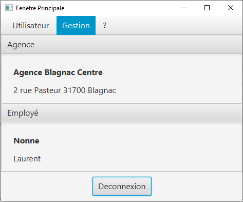
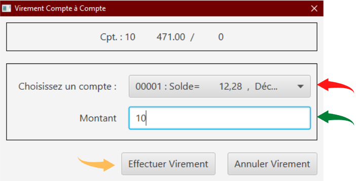

= Documentation Utilisateurs V1 DailyBank 08/06/2022
:toc:
:toc-title: Sommaire

== Équipe
* Bastien BALMES 
* Léo FALETTI
* Esteban BIRET-TOSCANO
* Hugo VACQUIER

== 1. Présentation de l’application DailyBank

"La banque DailyBank souhaite développer une application JAVA-Oracle de gestion des comptes clients pour remplacer plusieurs outils obsolètes. Ce développement s’inscrit dans le cadre de la restructuration de ses services bancaires et l’application sera déployée dans les 100 agences que compte son réseau. Vous travaillerez à partir d’une application existante « Daily Bank » qu’il faudra adapter aux nouveaux besoins de la banque."

L’application DailyBank et faite pour deux utilisateurs distincts : 

** Les guichetiers : Ils possèdent les droits leur permettant de gérer des clients ainsi comptes que des comptes de l'agence. Mais aussi :
* Créditer/débiter un compte
* Créer un compte
* Effectuer un virement de compte à compte
* Clôturer un compte
** Les Chefs d’Agence : Quant à lui me Chef d'Agence peut faire les mêmes choses que le guichetier mais il peut en plus :
* Gérer (faire le « CRUD ») les employés

== 2. Lancement de l'application

=== Démarrage de l'application :  ===

Voici la page d'accueil qui ce présente à vous quand vous lancez l'application :

image::page d'accueil.png[]

Une fois sur cette page vous n'avez que deux options :  +
    -Quitter l'application +
    -Vous connecter à un compte de guichetier ou de chef d'agence grace au bouton "connexion"

==  3. Utilisation de l'application : Guichetier

=== Connexion au compte guichetier :  ===

Une fois cliquer sur le bouton "connexion" vous atterrirez sur cette page dans laquelle vous devrez entrer votre identifiant ainsi que votre mot de passe.
Si le mot de passe ou l'identifiant n'est pas bon un message d'erreur apparaitra.

Une fois connecté nous retombons sur la page d'accueil mais cette fois nous pouvons voir les informations sur l'employé et son agence :

Vous avez maintenant accès aux fonctionnalités d'un guichetier.
    
=== Créditer/débiter un compte :  ===

Maintenant vous pouvez cliquer sur le bouton "Gestion" dans la barre de menu en haut et vous pourrez cliquer sur le bouton "client" qui vous amènera sur cette page :

image::Gestion des clients.png[]

Puis cliquer sur "Rechercher" pour afficher les différents comptes clients de l'agence comme ceci :

Puis sélectionnez le compte dont vous voulez modifier les informations et cliquer ensuite sur "Comptes client". +
Vous atterrirez sur une page vous présentant les différents comptes du client puis sélectionné en un puis cliqué sur "Voir opérations". +
Vous attérirrez sur cette page qui vous permettra de débiter de l'argent de se compte ou de faire un crédit.

image::debitercrediter.PNG[]

N'oubliez pas qu'il sera impossible de débiter un compte dont le solde n'est pas suffisant...

=== Créer un compte :  ===

Afin de créer un nouveau client nous allons revenir sur la page de gestion des clients vide :

image::Gestion des clients.png[]

Puis nous allons cliquer sur le bouton recherche à nouveau pour affiché tous les comptes existants.

Puis sélectionné un compte et cliqué sur "Comptes client"
Vous verrez apparaitre en bas de la page le bouton "nouveau compte"

Cliquez dessus et vous attérirrez sur cette petite fenètre.

image::test2.PNG[]

Sélectionnez le découvert autorisez et le solde de premier dépot car sans cela le compte ne pourra être crée, puis cliqué sur ajouter et vous verrez le compte apparaitre.

=== Effectuer un virement de compte à compte : ===

Afin d'effectuer un virement nous allons nous placé sur un compte client puis allons voir les opération. +
En bas des boutons créditer et débiter un compte ce trouve le bouton "Virement vers un compte", cliqué sur un compte et sélectionnez "Virement vers un compte". +

image::virementversuncompte.png[]

Vous atterrirez sur une page qui vous demandera de choisir le compte vers lequel vous voulez faire le virement et le montant que vous voulez envoyez. +
Vérifiez bien que le montant du virement est égale ou inférieur au solde du compte sinon le virement cera impossible.

=== Clôturer un compte : ===

Pour cloturer un compte nous allons sur un la page des comptes d'un client pour nous sélectionnons un compte et cliquons sur "Supprimer un compte" :

Puis on clique sur le compte en allant voir les opérations on se rend compte que on ne peux plus agir sur ce compte car les options sont désactiver

image::cloturercompte2.PNG[]

==  4. Utilisation de l'application : chef d'agence

=== Gérer (faire le « CRUD ») les employés :  ===

Pour ceci nous allons nous connecter sur un nouveau compte de chef d'agence cette fois ci :

Puis nous allons affichez tous les comptes existant et en cliquant sur un compte nous voyons que le boutons "Désactiver client" deviens disponible :

image::inactif2.PNG[]

On clique dessus et le compte deviens désactivé et les guichetier n'y auront plus accès.

