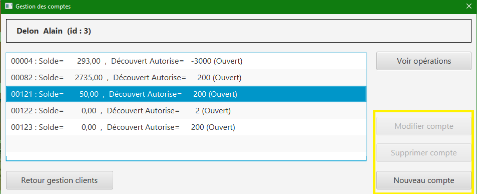

= Documentation Technique V1
:toc:
:toc-title: Sommaire

== Équipe
* Bastien BALMES 
* Léo FALETTI
* Esteban BIRET-TOSCANO
* Hugo VACQUIER

== 1. Présentation de l’application

"La banque DailyBank souhaite développer une application JAVA-Oracle de gestion des comptes clients pour remplacer plusieurs outils obsolètes. Ce développement s’inscrit dans le cadre de la restructuration de ses services bancaires et l’application sera déployée dans les 100 agences que compte son réseau. Vous travaillerez à partir d’une application existante « Daily Bank » qu’il faudra adapter aux nouveaux besoins de la banque."

=== Use Case de la V1 :

image::Capture2.png[]

L’application DailyBank et faite pour deux utilisateurs distincts : 

** Les guichetiers : Ils possèdent les droits leur permettant de gérer des clients ainsi comptes que des comptes de l'agence. Mais aussi :
* Clôturer un compte
* Effectuer un virement de compte à compte
* Modifier les informations des clients
* Créer un nouveau client
* Consulter un compte
* Débiter/Créditer un compte
* Débiter un compte

** Les Chefs d’Agence : Un Chef d'Agence peut faire les mêmes choses que le guichetier, avec en plus :
* Rendre inactif un client
* Gérer le CRUD

== 2. Architecture

=== Installation : ===

    Pour l'installation de l'application DailyBank, on peut l'installer sur github dans les différents dépôts.
    
image::Capture6.PNG[]
_Emplacement du fichier V1 du code._

=== Le .jar : ===

    Le .jar est trouvable dans le dossier de l'application DailyBank.

=== Répartition du travail : ===

_Différentes tâches du projet ainsi que le temps nécessaires à leur réalisation._ +

image::Capture4.PNG[]
_Diagramme de Gantt contenant ces tâches._

=== Les packages : ===

    application
        DailyBank : main() de départ

    application.control
        Contrôleurs de dialogue et accès aux données : gestion des fonctionnalités de l’application

    application.view
        Vues de l’application avec les fichiers fxml et controleur associé : gestion des vues uniquement : affichages, contrôle de saisies

    application.tools
        Utilisé pour application.view et application.control

    model.data
        Classes java pour les table de la BD

    model.orm
        Classes permetant l'accès à la BD

    model.exception
        Classes des exceptions pour la  BD, levées par les classes de model.orm

==  3. Fonctionnalités de l’application
    
=== Création d’un nouveau client :  ===

image::creer.PNG[]

Cette fonctionnalité permet à tous les utilisateurs de l'application de créer un nouveau client.
Lorsque un utilisateur clique sur le bouton "nouveau client", le contrôleur clientsmanagementcontroller du package application.control transfère les informations nécessaires au contrôleur clientsmanagement du package application.control pour l’affichage de la fenêtre de création d’un client. Une fois fait, une fenêtre s'affiche avec toutes les informations du client. Ses informations doivent être valide pour que la création de celui-ci soit validé. Une fois les informations validées les informations s'enregistrent dans la base de données, les informations de ce nouveau client son ensuite affichées dans le contrôleur clientsmanagementcontroller.

image::creer3.PNG[]
_Interface de création d'un client._

=== Modification d’un client :  ===

image::creer.PNG[]
image::modifier.PNG[]
Cette fonctionnalité permet à tous les utilisateurs de l'application de modifier les informations d'un client présent dans la base de données.
Lorsqu'un utilisateur clique sur le bouton "modifier", le contrôleur clientsmanagementcontroller du package application.control transfère les informations nécessaires au contrôleur clientsmanagement du package application.control pour l’affichage de la fenêtre de modification d’un client. Une fois fait, une fenêtre s'affiche où toutes les informations du client apparaissent, chacune des ces informations peuvent être modifiées si chacune d'entre elles sont valides. Une fois que les informations modifiées sont validées les informations s'actualisent dans la base de données, les nouvelles informations du client sont ensuite affichées dans le contrôleur clientsmanagementcontroller.

_Interface de modification d'un client._

=== Consultation des clients : ===
image::creer.PNG[]
image::rechercher1.PNG[]
Cette fonctionnalité permet à tous les utilisateurs de l'application de consulter la liste des clients.
Lorsque un utilisateur clique sur le bouton "rechercher", le contrôleur clientsmanagementcontroller du package application.control transfère les informations nécessaires à l’affichage des clients. Elle permet de consulter la liste des clients de l’Agence bancaire. 

image::rechercher.PNG[]
_Interface de recherche et de consultation des clients._

=== Consulter les comptes d’un client : ===

image::consulter2.PNG[]
Cette fonctionnalité permet à tous les utilisateurs de l'application de consulter les comptes d'un client.
Lorsque un utilisateur clique sur un des clients de la liste, le bouton « comptes client » peut être cliqué. Si le bouton est cliqué, le contrôleur comptesmanagementcontroller du package application.view transfère les informations au contrôleur comptesmanagement du package application.control pour l’affichage de la fenêtre de gestion des comptes. Si tout se passe correctement une fenêtre avec toutes les informations comptes du client choisi s'ouvre.

image::screen1.PNG[]
_Interface de consultation des comptes d'un client._

=== Consulter les opérations des comptes des clients :  ===

image::operation1.PNG[]
Cette fonctionnalité permet à tous les utilisateurs de l'application de consulter les opérations des comptes des clients.
Lorsqu'un utilisateur clique sur un des clients de la liste, le bouton « voir opérations » peut être cliqué.  Si le bouton est cliqué, le contrôleur comptesmanagementcontroller du package application.view transfère les informations au contrôleur operationmanagement du package application.control pour l’affichage de la fenêtre de gestion des opérations de chaque client. Si tout se passe correctement, une fenêtre avec toutes les opérations d'un compte du client choisi s'ouvre.

_Interface de consultation des opérations d'un client._
=== Débiter un compte : === 
image::debit.PNG[]
image::debit1.PNG[]
Cette fonctionnalité permet à tous les utilisateurs de l'application de consulter les opérations des comptes des clients.
Lorsqu'un utilisateur clique sur un des clients de la liste, le bouton « voir opérations » peut être cliqué. Si tous ce passe correctement une fenêtre avec toutes les opérations d'un compte du client choisi s'ouvre, il faut ensuite cliquer sur l'un des comptes, puis sur le bouton "voir opérations". Une fenêtre s'ouvre et il suffit de cliquer sur le bouton "Enregistrer débit". Chaque opération est enregistrée.

_Interface de débit d'un compte._
=== Rendre inactif un client : === 
image::inactif.PNG[]
image::inactif1.PNG[]
Cette fonctionnalité permet seulement au chef d'agence de l'application de rendre inactif un client.
Lorsque le chef d'agence clique sur un des clients de la liste, le bouton « désactiver client » peut être cliqué. Si le bouton est cliqué, le contrôleur comptesmanagementcontroller du package application.view transfère les informations nécessaires pour désactiver le client.

image::inactif2.PNG[]
_Emplacement du bouton pour désactiver un compte._

=== Débiter/Créditer un compte : === 
image::debit.PNG[]

Cette fonctionnalité permet à tous les utilisateurs de l'application de consulter les opérations des comptes des clients.
Lorsqu'un utilisateur clique sur un des clients de la liste, le bouton « voir opérations » peut être cliqué. Si tout se passe correctement, une fenêtre avec toutes les opérations d'un compte du client choisi s'ouvre, il faut ensuite cliquer sur l'un des comptes, puis sur le bouton "voir opérations". Une fenêtre s'ouvre et enfin il suffit de cliquer sur le bouton "Enregistrer débit" ou "Enregistrer crédit". Chaque opération est enregistrer.

_Interface de débit et de crédit d'un compte._
=== Clôturer un compte : === 
image::cloture.PNG[]

Cette fonctionnalité permet à tous les utilisateurs de l'application de clôturer un compte.
à implémenter :

_Emplacement du bouton pour supprimer un compte._

=== Gérer le CRUD : === 

Cette fonctionnalité permet seulement au chef d'agence de l'application de gérer un employé (créer, lire, mettre à jour, supprimer).
à implémenter :

image::crud2.PNG[]

=== Effectuer un virement de compte à compte : === 
image::virement.PNG[]
image::virement1.PNG[]
Cette fonctionnalité permet à tous les utilisateurs de l'application d'effectuer un virement de compte à compte. Le bouton pour aller à la fenêtre de virement n'est pas encore présent, il sera mis dans le rectangle rouge présent sur la capture d'écran. à implémenter :

image::virement2.PNG[]
image::virement3.PNG[]
