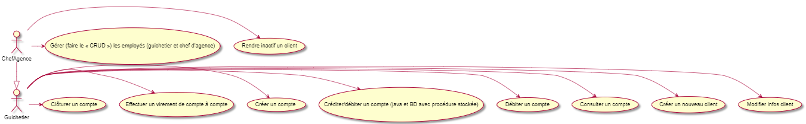

= Documentation Technique V1
:toc:
:toc-title: Sommaire

== Équipe
* Bastien BALMES 
* Léo FALETTI
* Esteban BIRET-TOSCANO
* Hugo VACQUIER

== 1. Présentation de l’application

"La banque DailyBank souhaite développer une application JAVA-Oracle de gestion des comptes clients pour remplacer plusieurs outils obsolètes. Ce développement s’inscrit dans le cadre de la restructuration de ses services bancaires et l’application sera déployée dans les 100 agences que compte son réseau. Vous travaillerez à partir d’une application existante « Daily Bank » qu’il faudra adapter aux nouveaux besoins de la banque."

=== Use Case global :

L’application DailyBank et faite pour deux utilisateurs distincts : 

** Les guichetiers : Ils possèdent les droits leur permettant de gérer des clients ainsi comptes que des comptes de l'agence. Mais aussi :
* Clôturer un compte
* Effectuer un virement de compte à compte
* Modifier les informations des clients
* Créer un nouveau client
* Consulter un compte
* Débiter/Créditer un compte
* Débiter un compte

** Les Chefs d’Agence : Quant à lui me Chef d'Agence peut faire les mêmes choses que le guichetier mais il peut en plus :
* Rendre inactif un client
* Gérer le CRUD

== 2. Architecture

=== Installation : ===

    Pour l'installation de l'application DailyBank, ont peut l'installer sur github dans les différends dépôts.
    

=== Le .jar : ===

    Le .jar est trouvable dans le dossier de l'application DailyBank

=== Répartition du travail : ===
image::Capture5.PNG[]
image::Capture4.PNG[]

=== Les packages : ===

    application
        DailyBank : main() de départ

    application.control
        Contrôleurs de dialogue et accès aux données : gestion des fonctionnalités de l’application

    application.view
        Vues de l’application avec les fichiers fxml et controleur associé : gestion des vues uniquement : affichages, contrôle de saisies

    application.tools
        Utilisé pour application.view et application.control

    model.data
        Classes java pour les table de la BD

    model.orm
        Classes permetant l'accès à la BD

    model.exception
        Classes des exceptions pour la  BD, levées par les classes de model.orm

==  3. Fonctionnalités de l’application

    
=== Création d’un nouveau client :  ===

Cette fonctionnalité permet à tous les utilisateurs de l'application de créer un nouveau client.
Lorsque un utilisateur clique sur le bouton "nouveau client", le contrôleur clientsmanagementcontroller qui transfère les informations nécessaire au contrôleur clientsmanagement pour l’affichage de la fenêtre de création d’un client. Une fois fait, une fenêtre s'affiche où toutes les informations du client doivent être valide pour que la création de celui-ci soit validé. Une fois les informations validées les informations s'enregistre dans la base de données, les informations de ce nouveaux client son ensuite affichée dans le contrôleur clientsmanagementcontroller.

=== Modification d’un client :  ===

Cette fonctionnalité permet à tous les utilisateurs de l'application de modifier les informations d'un client présent dans la base de données.
Lorsqu'un utilisateur clique sur le bouton "modifier", le contrôleur clientsmanagementcontroller  transfère les informations nécessaire au contrôleur clientsmanagement pour l’affichage de la fenêtre de modification d’un client. Une fois fait, une fenêtre s'affiche ou toutes les informations du client apparaissent, chacune des ces informations peuvent être modifier si chacune d'entre elles sont valident. Une fois que les informations modifiées son validées les informations s'actualise dans la base de données, les nouvelles informations du client sont ensuite affichées dans le contrôleur clientsmanagementcontroller.

=== Consultation des clients : ===

Cette fonctionnaliteé permet à tous les utilisateurs de l'application de consulté la listes des clients.
Lorsque un utilisateur clique sur le bouton "rechercher", le contrôleur clientsmanagementcontroller qui transfère les informations nécessaire à l’affichage des clients. Elle permet de consulter la liste des clients de l’Agence bancaire. 

=== Consulter les comptes d’un client : ===
image::consulter1.PNG[]

Cette fonctionnalitée permet à tous les utilisateurs de l'application de consulter les comptes d'un client.
Lorsque un utilisateur clique sur un des clients de la liste, le bouton « comptes client » peut être cliqué. Si le bouton est cliqué, le contrôleur comptesmanagementcontroller du package application.view transfère les informations au contrôleur comptesmanagement application.control pour l’affichage de la fenêtre de gestion des comptes. Si tous ce passe correctement une fenêtre avec toutes les informations comptes du client choisie s'ouvre.

=== Consulter les opérations des comptes des clients :  ===

Cette fonctionnalitée  permet à tous les utilisateurs de l'application de consulter les opérations des comptes des clients.
Lorsqu'un utilisateur clique sur un des clients de la liste, le bouton « voir opérations » peut être cliqué.  Si le bouton est cliqué, le contrôleur comptesmanagementcontroller transfère les informations au contrôleur operationmanagement pour l’affichage de la fenêtre de gestion des opérations de chaque client. Si tous ce passe correctement une fenêtre avec toutes les opérations d'un compte du client choisie s'ouvre.

=== Débiter un compte === 

Cette fonctionnalitée  permet à tous les utilisateurs de l'application de consulter les opérations des comptes des clients.
Lorsqu'un utilisateur clique sur un des clients de la liste, le bouton « voir opérations » peut être cliqué. Si tous ce passe correctement une fenêtre avec toutes les opérations d'un compte du client choisie s'ouvre, il faut ensuite cliquer sur l'un des comptes, puis sur le bouton "voir opérations" ensuite une fenêtre s'ouvre et enfin il suffit de cliquer sur le bouton "Enregistrer débit" chaque opération est enregistrer.

=== Rendre inactif un client : === 

Cette fonctionnalitée  permet seulement au chef d'agence de l'application de rendre inactif un client.
Lorsque un utilisateur clique sur un des clients de la liste, le bouton « désactiver client » peut être cliqué. Si le bouton est cliqué, le contrôleur comptesmanagementcontroller transfère les informations nécessaire pour désactiver un client.

=== Débiter/Créditer un compte : === 

Cette fonctionnalitée  permet à tous les utilisateurs de l'application de consulter les opérations des comptes des clients.
Lorsqu'un utilisateur clique sur un des clients de la liste, le bouton « voir opérations » peut être cliqué. Si tous ce passe correctement une fenêtre avec toutes les opérations d'un compte du client choisie s'ouvre, il faut ensuite cliquer sur l'un des comptes, puis sur le bouton "voir opérations" ensuite une fenêtre s'ouvre et enfin il suffit de cliquer sur le bouton "Enregistrer débit" ou "Enregistrer débit" chaque opération est enregistrer.

=== Clôturer un compte : === 

Cette fonctionnalitée  permet à tous les utilisateurs de l'application de clôturer un compte.
à implémenter :

=== Gérer le CRUD === 

Cette fonctionnalitée  permet seulement au chef d'agence de l'application de gérer un employer (créer, lire, mettre à jour, supprimer).
à implémenter :

=== Effectuer un virement de compte à compte === 

Cette fonctionnalitée  permet à tous les utilisateurs de l'application d'effectuer un virement de compte à compte.
à implémenter :

