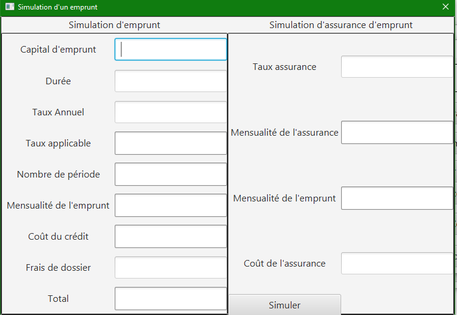

= Documentation Utilisateurs finale Daily Bank - 10/06/2022
:toc:
:toc-title: Sommaire

== Document réservé à la banque DailyBank

== Équipe
* Bastien BALMES 
* Léo FALETTI
* Esteban BIRET-TOSCANO
* Hugo VACQUIER

== 1. Présentation de l’application

"La banque DailyBank souhaite développer une application JAVA-Oracle de gestion des comptes clients pour remplacer plusieurs outils obsolètes. Ce développement s’inscrit dans le cadre de la restructuration de ses services bancaires et l’application sera déployée dans les 100 agences que compte son réseau. Vous travaillerez à partir d’une application existante « Daily Bank » qu’il faudra adapter aux nouveaux besoins de la banque."

L’application DailyBank et faite pour deux utilisateurs distincts : 

** Les guichetiers : Ils possèdent les droits leurs permettants de gérer des clients ainsi que des comptes de l'agence, mais aussi :
* Modifier les informations des clients
* Créer un nouveau client
* Consulter un compte
* Débiter un compte
* Créditer/débiter un compte
* Créer un compte
* Effectuer un virement de compte à compte
* Clôturer un compte
* Générer un relevé mensuel d’un compte en PDF
* Gérer les prélèvements automatiques des comptes
** Les Chefs d’Agence : Quant à eux les Chef d'Agence ont accés aux mêmes fonctionnalités que les guichetiers mais ils peuvent en plus :
* Rendre inactif un client
* Gérer les employés de son agence
* Effectuer un Débit exceptionnel
* Simuler un emprunt

== 2. Lancement de l'application

=== Démarrage de l'application :  ===

Voici la page d'accueil qui se présente à vous quand vous lancez l'application :

image::page d'accueil.png[]

Une fois sur cette page vous n'avez que deux options :  +
    -Quitter l'application +
    -Vous connecter à un compte de guichetier ou de chef d'agence grace au bouton "connexion"

==  3. connexion à l'application :

=== Connexion au compte guichetier :  ===

Une fois le bouton "connexion" cliqué, vous atterrirez sur cette page dans laquelle vous devrez entrer votre identifiant ainsi que votre mot de passe.
Si le mot de passe ou l'identifiant n'est pas bon un message d'erreur apparaitra.
Le compte que nous allons utiliser en tant que guichetier est : LN - Levieux

image::Connexion guichetier.png[]

Une fois connecté nous retombons sur la page d'accueil mais cette fois nous pouvons voir les informations sur l'employé et son agence :

image::page d'accueil Guichetier.png[]

Vous avez maintenant accès aux fonctionnalités d'un guichetier.

=== Connexion au compte chef d'agence : ===

Une fois le bouton "connexion cliqué, vous atterrirez sur cette page dans laquelle vous devrez entrer votre identifiant de chef d'agence ainsi que votre mot de passe. +
Si le mot de passe ou l'identifiant n'est pas bon un message d'erreur apparaitra. +
Le compte que nous allons utiliser en tant que chef d'agence est : Tuff - Lejeune

Une fois connecté nous retombons sur la page d'accueil mais cette fois nous pouvons voir les informations sur le chef d'agence et sur son agence :

image::page d'accueil chef d'agence.png[]

Vous avez maintenant accès aux fonctionnalités d'un chef d'agence.

==  4a. Version existante V0 guichetier :
    
=== Modifier informations client :  ===

Maintenant vous pouvez cliquer sur le bouton "Gestion" dans la barre de menu en haut et vous pourrez cliquer sur le bouton "client" qui vous amènera sur cette page :

Puis cliquer sur "Rechercher" pour afficher les différents comptes clients de l'agence comme ceci :

image::Gestion des clients2.png[]

Sélectionnez le compte dont vous voulez modifier les informations et cliquez ensuite sur "Modifier client". +
Vous atterrirez sur cette page là dans laquelle vous pourrez modifier les informations du client comme vous le souhaitez.

image::Modifier information client.png[]

=== Créer un nouveau client :  ===

Afin de créer un nouveau client nous allons revenir sur la page de gestion des clients vide :

Puis nous allons cliquer sur le bouton "nouveau client" en bas à droite de la page. +
Nous atterissons donc sur cette page :

Vous n'avez plus qu'à remplir les informations concernant le client puis à cliquer sur le bouton "ajouter" :

image::Nouveau client_hugo.png[]

Retournez sur la page de gestion des comptes puis en cliquant sur "rechercher" vous verrez le nouveau compte s'afficher en bas de la page.

=== Consulter un compte : ===

Afin de consulter un compte nous allons rester sur cette page puis selectionner un compte lambda et cliquer sur "Comptes client" :

image::Gestion des clients2.png[]

Vous atterrirez sur une page qui nous donnera toutes les informations sur les différents comptes du client dans cette agence.

=== Débiter un compte : ===

Pour débiter un compte nous restons sur la page de consultation d'un compte client :

puis on sélectionne un compte et on clique sur le bouton "voir opérations" qui nous amène ici :

image::Gestion des opérations.png[]

Puis nous cliquons sur "Enregistrer débit" et nous rentrons la somme et la manière dont nous débitons l'argent du compte :

Nous revenons ensuite sur la fenêtre des informations du compte du client et nous remarquons que en effet l'argent a été débité du compte.

image::Débit de 50.png[]

==  4b. Version existante V0 chef d'agence :

=== Rendre inactif un client :  ===

Nous allons sélectionner un compte client et nous allons sélectionner ses informations clients. +
Nous pouvons voir que en bas nous pouvons maintenant rendre un client inactif :

La fonctionnalité n'est pas encore opérationnel mais ce bouton permet de supprimer un client de la base de données.

==  5a. Version développer V1 guichetier :

=== Créditer/débiter un compte :  ===

Maintenant vous pouvez cliquer sur le bouton "Gestion" dans la barre de menu en haut, et vous pourrez cliquer sur le bouton "client" qui vous amènera sur cette page :

Puis cliquer sur "Rechercher" pour afficher les différents comptes clients de l'agence comme ceci :

image::Gestion des clients2.png[]

Sélectionnez le compte dont vous voulez modifier les informations et cliquer ensuite sur "Comptes client". +
Vous atterrirez sur une page vous présentant les différents comptes du client, où vous pourrez en selectionner un. +
En cliquant ensuite sur "Voir opérations", une page qui vous permettra de débiter de l'argent de ce compte ou de faire un crédit s'ouvrira.

N'oubliez pas qu'il sera impossible de débiter un compte dont le solde n'est pas suffisant...

=== Créer un compte :  ===

Afin de créer un nouveau client nous allons revenir sur la page de gestion des clients vide :

Puis nous allons cliquer sur le bouton recherche à nouveau pour afficher tous les comptes existants.

image::Gestion des clients2.png[]

En sélectionnant un compte et en cliquant sur "Comptes client" vous verrez apparaitre en bas de la page le bouton "nouveau compte" :

image::test.png[]

Cliquez dessus et cette petite fenêtre s'ouvrira.

Sélectionnez le découvert autorisé et le solde de premier dépot car sans cela le compte ne pourra être créé. Cliquez ensuite sur ajouter et vous verrez le compte apparaitre dans la liste.

=== Effectuer un virement de compte à compte : ===

Afin d'effectuer un virement nous allons nous placer sur un compte client puis allons voir les opération. +
En bas des boutons créditer et débiter un compte ce trouve le bouton "Virement vers un compte". Selectionnez un compte et cliquez sur "Virement vers un compte". +

Vous atterrirez sur une page qui vous demandera de choisir le compte vers lequel vous voulez faire le virement et le montant que vous voulez envoyer. +
Vérifiez bien que le montant du virement est égal ou inférieur au solde du compte sinon le virement sera impossible.

image::virementversuncompte2.png[]

=== Clôturer un compte : ===

Pour cloturer un compte, rendez vous sur la page des comptes d'un client pour sélectionner le compte concerné et cliquer sur "Supprimer un compte" :

image::Capture.png[]

En cliquant sur le compte en allant voir les opérations on se rend compte que on ne peux plus agir sur ce compte car les options sont désactivées :

==  5b. Version développer V1 chef d'agence :

=== Gérer les employés :  ===

Pour ceci nous allons nous connecter sur un nouveau compte de chef d'agence cette fois ci :

image::page d'accueil chef d'agence.png[]

En affichant tous les comptes existants et en cliquant sur un compte nous voyons que le bouton "Désactiver client" devient disponible :

image::inactif2.png[]

On clique dessus et le compte se désactive, et les guichetiers n'y auront plus accès.

==  6a. Version développer V2 guichetier :

=== Générer un relevé mensuel d’un compte en PDF : ===

Pour générer le relevé mensuel d'un compte en PDF nous allons commencer par choisir un compte client comme celui ci :

Puis une fenêtre s'ouvrira pour vous signaler l'endroit ou se situe le PDF.

Suivez le chemin indiqué et vous pourrez ouvrir le PDF pour observer votre relevé mensuel :

=== Gérer les prélèvements automatiques des comptes : ===

==  6b. Version développer V2 chef d'agence :

=== Effectuer un Débit exceptionnel : ===

=== Simuler un emprunt : ===

Pour simuler un emprunt nous devons nous placer dans la gestion des comptes d'un client :

Nous cliquons ensuite sur le bouton "Simuler un emprunt" qui nous amènera sur cette nouvelle page :

Remplissez toutes les informations nécessaire sous peine de voir cette petite fenêtre s'afficher :

Une fois toutes les informations remplies un message vous signalera que la simulation est réussie et vous aurez accés aux informations que vous cherchiez.

image::simulerunemprunt.png[]

