= Documentation Technique V2 DailyBank - 12/06/2022
:toc:
:toc-title: Sommaire

== Équipe
* Bastien BALMES 
* Léo FALETTI
* Esteban BIRET-TOSCANO
* Hugo VACQUIER

== 1. Présentation de l’application

"La banque DailyBank souhaite développer une application JAVA-Oracle de gestion des comptes clients pour remplacer plusieurs outils obsolètes. Ce développement s’inscrit dans le cadre de la restructuration de ses services bancaires et l’application sera déployée dans les 100 agences que compte son réseau. Vous travaillerez à partir d’une application existante « Daily Bank » qu’il faudra adapter aux nouveaux besoins de la banque."

=== Use Case de la V1 :

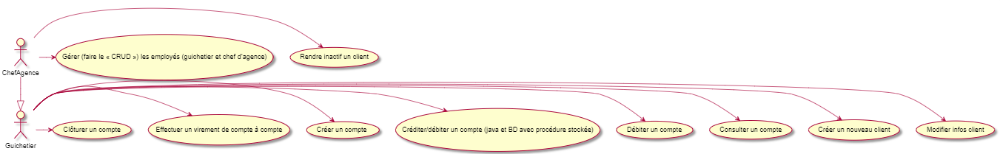

L’application DailyBank est faite pour deux utilisateurs distincts : 

** Les guichetiers : Ils possèdent les droits leur permettant de gérer des clients ainsi que des comptes de l'agence. Mais aussi :
* Clôturer un compte
* Effectuer un virement de compte à compte
* Modifier les informations des clients
* Créer un nouveau client
* Consulter un compte
* Débiter/Créditer un compte
* Débiter un compte

** Les Chefs d’Agence : Un Chef d'Agence peut faire les mêmes choses que le Guichetier, avec en plus :
* Rendre inactif un client
* Gérer les employés (faire le CRUD)

== 2. Architecture

=== Installation : ===

    Pour l'installation de l'application DailyBank, rendez-vous sur Github dans les différents dépôts.
    
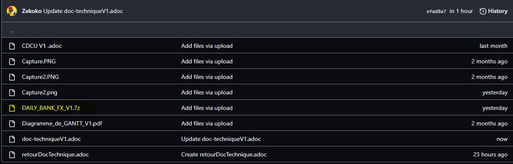
_Emplacement du fichier V1 du code._

=== Le .jar : ===

    Le .jar est trouvable dans le main de notre répository.

=== Répartition du travail : ===
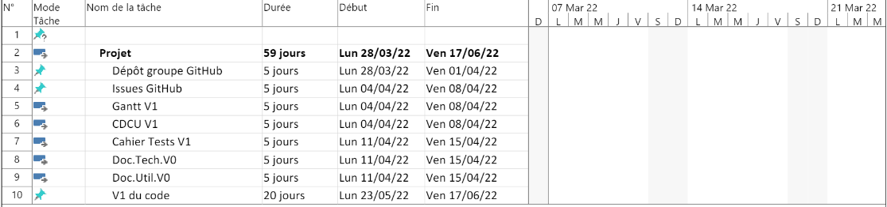
_Différentes tâches du projet ainsi que le temps nécessaires à leur réalisation._ +

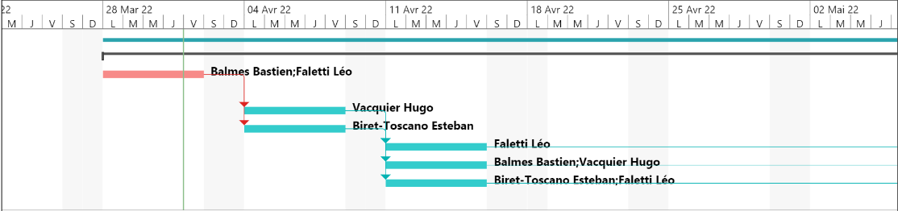
_Diagramme de Gantt contenant ces tâches._

=== Les packages : ===

    application
        DailyBank : main() de départ

    application.control
        Contrôleurs de dialogue et accès aux données : gestion des fonctionnalités de l’application

    application.view
        Vues de l’application avec les fichiers fxml et controleur associé : gestion des vues uniquement : affichages, contrôle de saisies

    application.tools
        Utilisé pour application.view et application.control

    model.data
        Classes java pour les table de la BD

    model.orm
        Classes permetant l'accès à la BD

    model.exception
        Classes des exceptions pour la  BD, levées par les classes de model.orm

==  3. Fonctionnalités de l’application

=== Version développée 1 : ===
    
=== Création d’un nouveau client :  ===

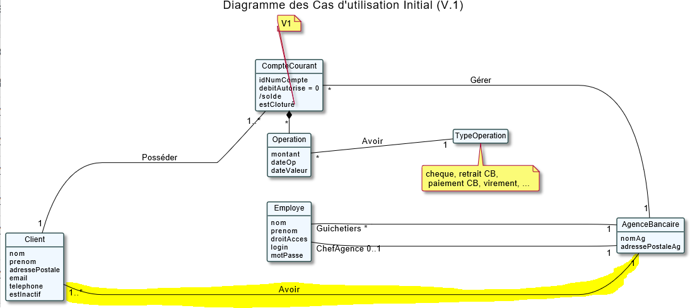
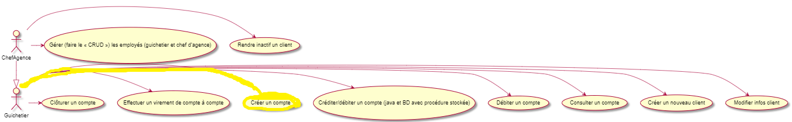
Cette fonctionnalité permet à tous les utilisateurs de l'application de créer un nouveau client.
Lorsque un utilisateur clique sur le bouton "Nouveau client", le contrôleur clientsmanagementcontroller du package application.control transfère les informations nécessaires au contrôleur clientsmanagement du package application.control pour l’affichage de la fenêtre de création d’un client. Une fois fait, une fenêtre s'affiche avec toutes les informations du client. Ces informations doivent être valide pour la création du client en question. Une fois les informations validées, elles s'enregistrent dans la base de données, et sont ensuite affichées dans le contrôleur clientsmanagementcontroller.

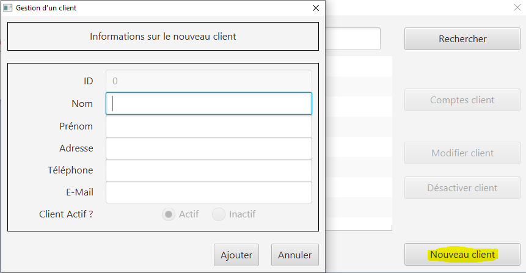
_Interface de création d'un client._

=== Modification d’un client :  ===

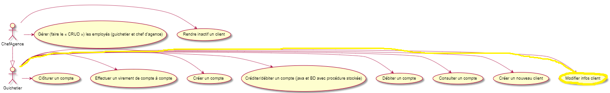
Cette fonctionnalité permet à tous les utilisateurs de l'application de modifier les informations d'un client présent dans la base de données.
Lorsqu'un utilisateur clique sur le bouton "modifier", le contrôleur clientsmanagementcontroller du package application.control transfère les informations nécessaires au contrôleur clientsmanagement du package application.control pour l’affichage de la fenêtre de modification d’un client. Une fois fait, une fenêtre s'affiche où toutes les informations du client apparaissent, chacune des ces informations peuvent être modifiées si chacune d'entre elles sont valides. Une fois que les informations modifiées sont validées, elles sont mises à jour dans la base de donnéeset affichées dans le contrôleur clientsmanagementcontroller.

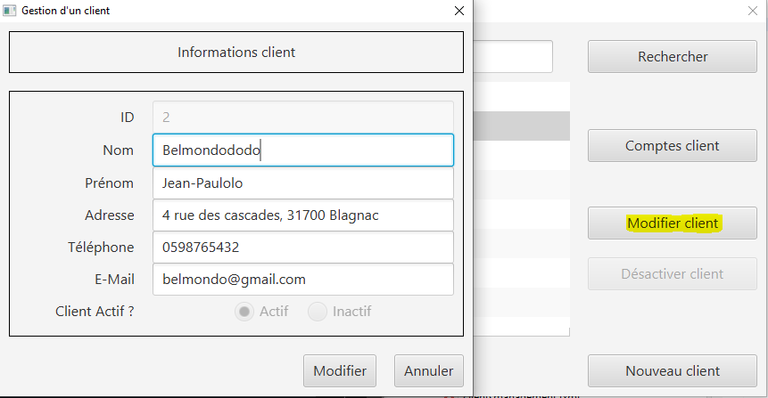
_Interface de modification d'un client._

=== Consultation des clients : ===

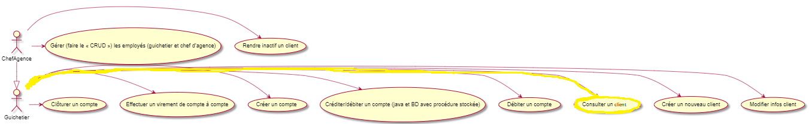
Cette fonctionnalité permet à tous les utilisateurs de l'application de consulter la liste des clients.
Lorsque un utilisateur clique sur le bouton "rechercher", le contrôleur clientsmanagementcontroller du package application.control transfère les informations nécessaires à l’affichage des clients. Elle permet de consulter la liste des clients de l’Agence bancaire. 

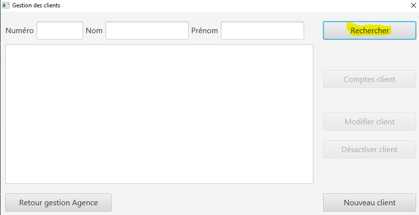
_Interface de recherche et de consultation des clients._

=== Consulter les comptes d’un client : ===
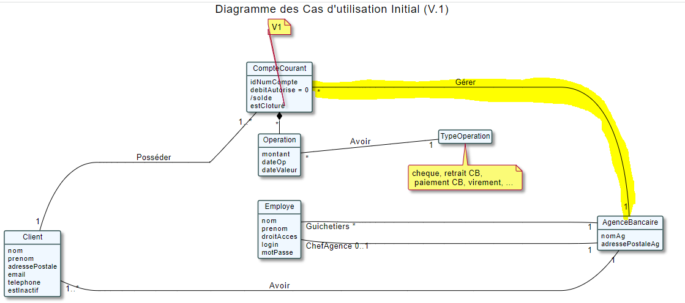
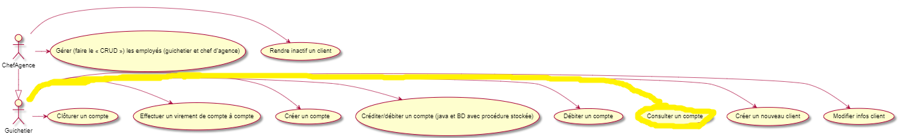
Cette fonctionnalité permet à tous les utilisateurs de l'application de consulter les comptes d'un client.
Lorsque un utilisateur clique sur un des clients de la liste, le bouton « comptes client » peut être cliqué. Si le bouton est cliqué, le contrôleur comptesmanagementcontroller du package application.view transfère les informations au contrôleur comptesmanagement du package application.control pour l’affichage de la fenêtre de gestion des comptes. Une fenêtre avec toutes les informations des comptes du client choisi s'ouvre alors.

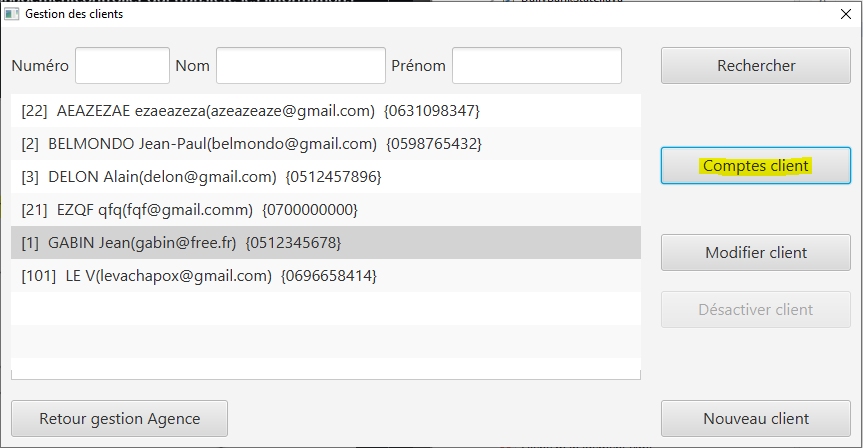
_Interface de consultation des comptes d'un client._

=== Consulter les opérations des comptes des clients :  ===
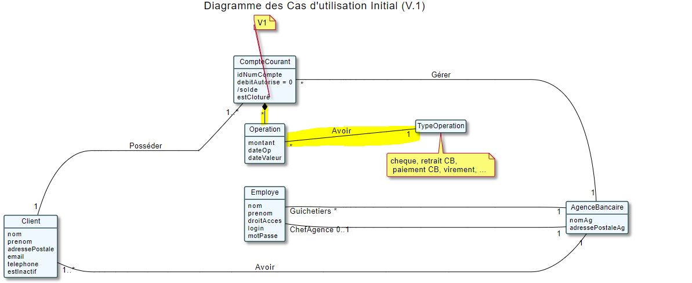
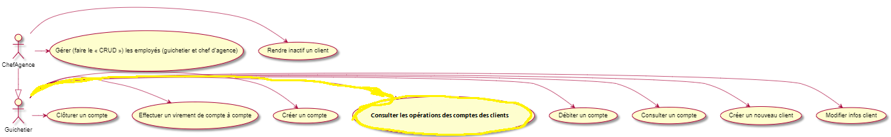
Cette fonctionnalité permet à tous les utilisateurs de l'application de consulter les opérations des comptes des clients.
Lorsqu'un utilisateur clique sur un des clients de la liste, le bouton « Voir opérations » est activé.  Si le bouton est cliqué, le contrôleur comptesmanagementcontroller du package application.view transfère les informations au contrôleur operationmanagement du package application.control pour l’affichage de la fenêtre de gestion des opérations de chaque client. Une fenêtre avec toutes les opérations d'un compte du client choisi s'ouvre alors.

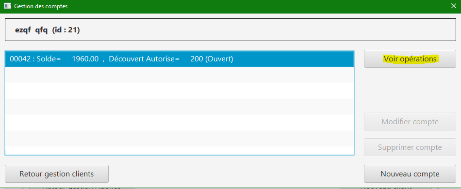
_Interface de consultation des opérations d'un client._

=== Débiter un compte : === 
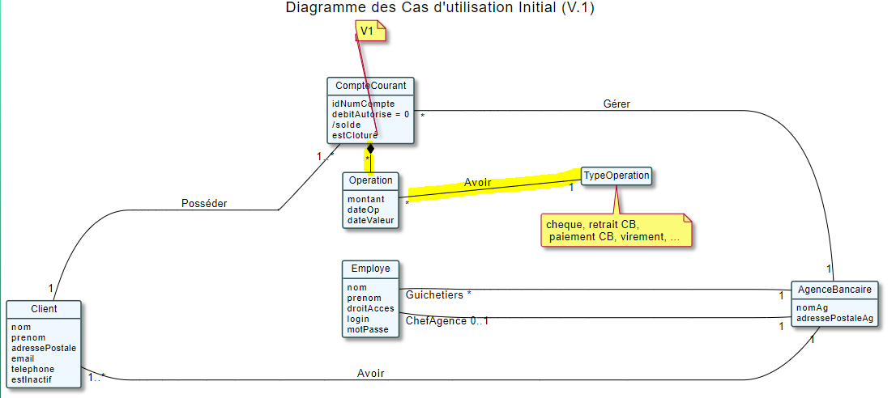
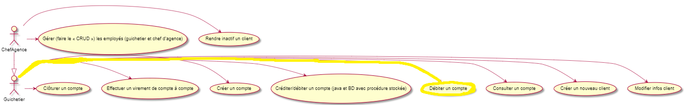
Cette fonctionnalité permet à tous les utilisateurs de l'application de consulter les opérations des comptes des clients.
Lorsqu'un utilisateur clique sur un des clients de la liste, le bouton « voir opérations » peut être cliqué. Si tous ce passe correctement une fenêtre avec toutes les opérations d'un compte du client choisi s'ouvre, il faut ensuite cliquer sur l'un des comptes, puis sur le bouton "voir opérations". Une fenêtre s'ouvre et il suffit de cliquer sur le bouton "Enregistrer débit". Chaque opération est enregistrée.

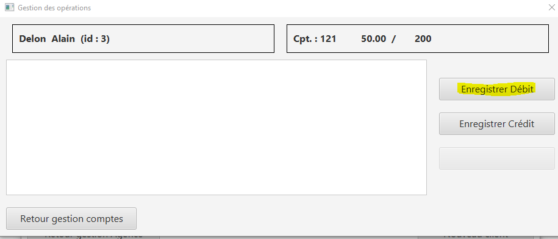
_Interface de débit d'un compte._

=== Rendre inactif un client : === 
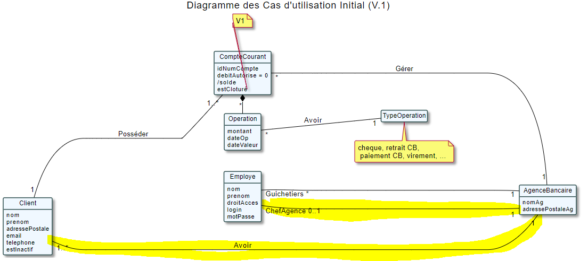
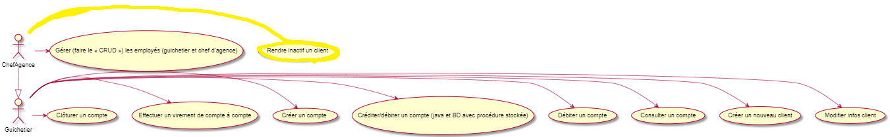hef d'agence de l'application de gérer un employé (créer, lire, mettre à jour, supprimer).
à implémenter :

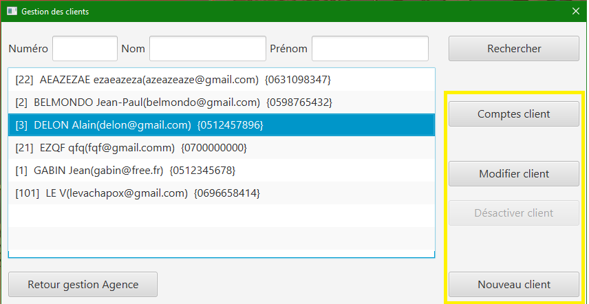
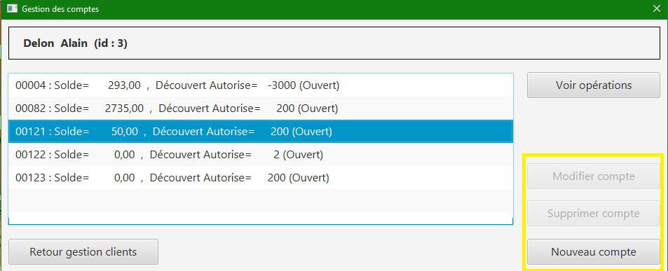

=== Effectuer un virement de compte à compte : === 
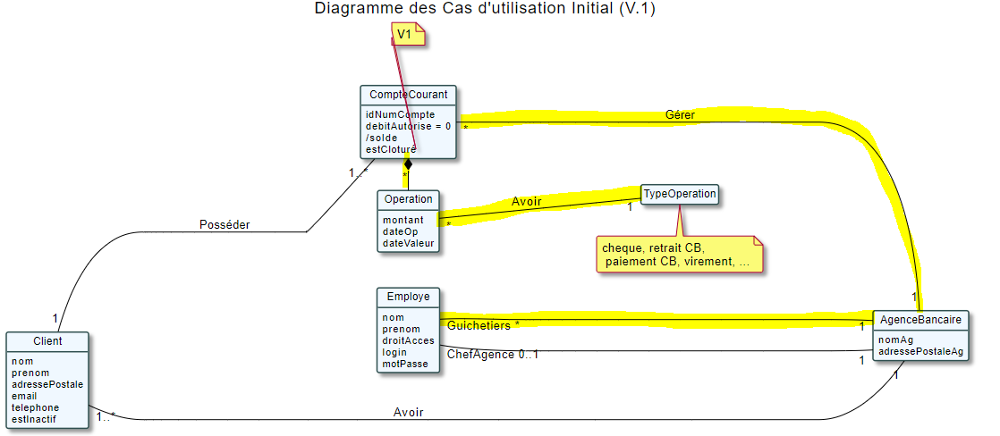
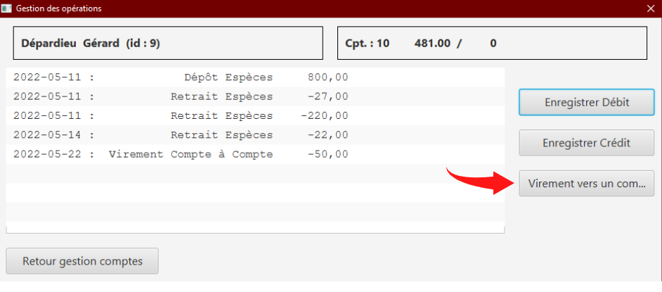
Cette fonctionnalité permet à tous les utilisateurs de l'application d'effectuer un virement de compte à compte. Il suffit de renseigner le montant et le numéro du compte choisi. IL faut que les deux comptes appartiennent au même client :

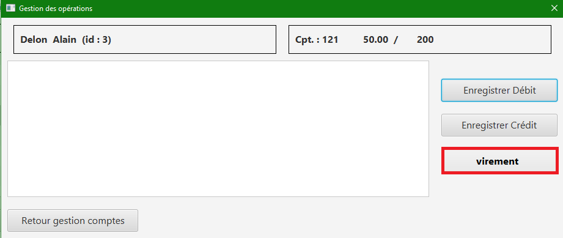
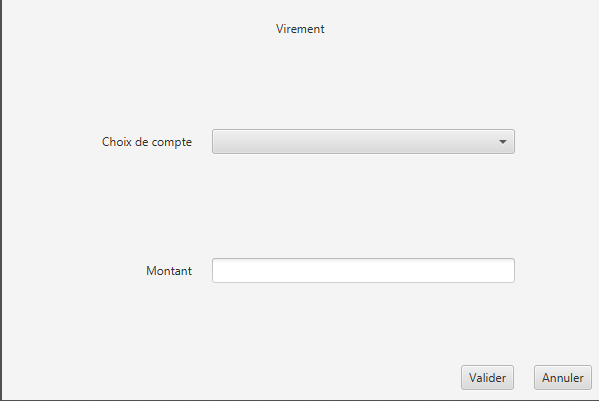

=== Version développé 2 : ===

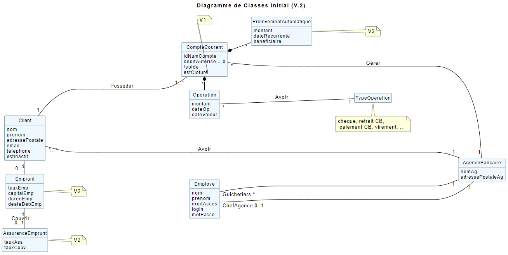

=== Générer un relevé mensuel d’un compte en PDF : === 

Cette fonctionnalité permet d'obtenir le relevé d'un compte client chaque mois pour qu'il puisse savoir ce qu'il à fait sur son compte.

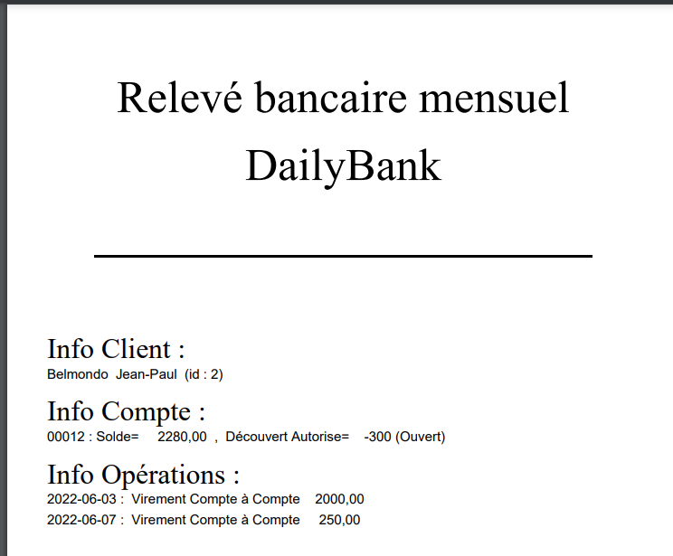

=== Effectuer un Débit exceptionnel : ===

Le débit exceptionnel est réservé aux chefs d'agences. Il leur permet d'effectuer sur un compte un débit qui dépasse le seuil de découvert autorisé par celui.

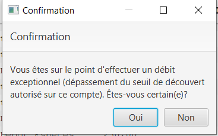

=== Simuler un emprunt : ===

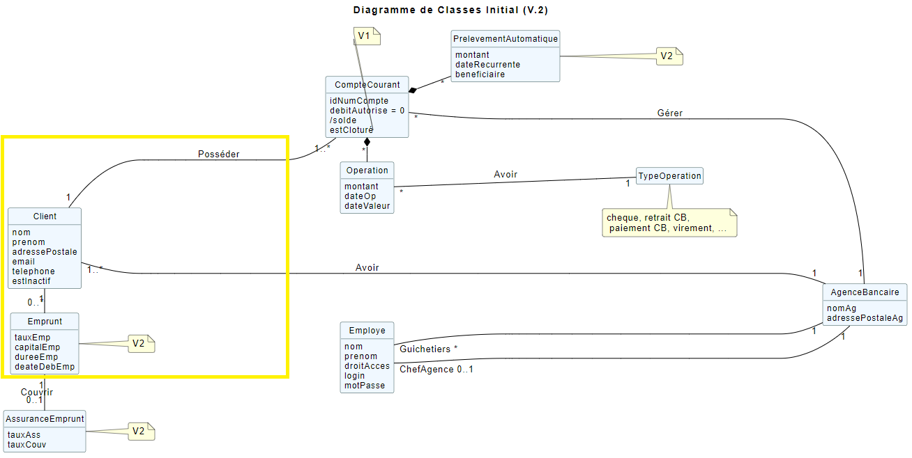

La simulation d'emprunt est une simple fonctionnalité sur l'application qui permettra aux clients de connaitre la somme d'argent qu'il devra à la banque suite à un emprunt d'une certain montant.

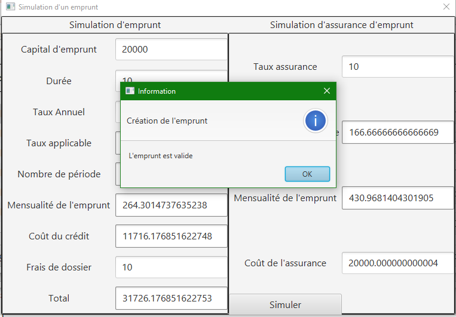

